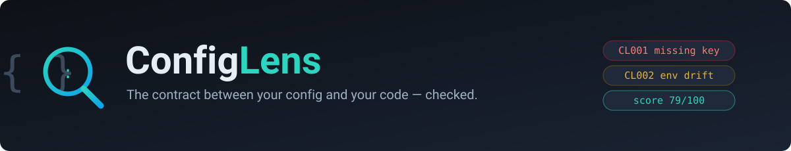
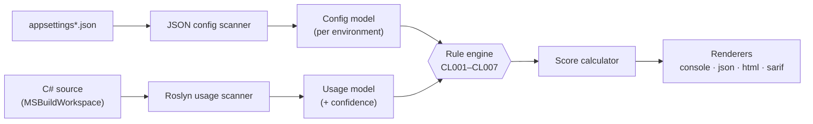

<p align="center">
  
</p>

<h3 align="center">Find the config bug before production does.</h3>

<p align="center">
  A static analyzer for the <b>contract between your configuration and your code</b>.
  It reads your <code>appsettings*.json</code> and the C# that actually consumes it,
  cross-references <b>both sides</b>, and reports the mismatches —
  missing keys, environment drift, dead config, type mismatches and hardcoded secrets —
  with a <b>Config Health Score</b> and an honest confidence level on every finding.
</p>

<p align="center">
  <a href="https://github.com/AdrianDeutsch/ConfigLens/actions/workflows/ci.yml"></a>
  
  
  
  
  
  <a href="LICENSE"></a>
</p>

<p align="center">
  <a href="#-quick-start">Quick start</a> ·
  <a href="#-what-it-finds">What it finds</a> ·
  <a href="#-how-it-works">How it works</a> ·
  <a href="#-vs-the-alternatives">Comparison</a> ·
  <a href="#-cli">CLI</a> ·
  <a href="#-roadmap">Roadmap</a>
</p>

---

## Overview

Every .NET team has lived this: the app works in `Development`, then crashes in `Production`
because a key was missing from `appsettings.Production.json`. Secrets scanners look at files.
Linters look at code. **Nothing looks at both sides of the contract** between configuration and
code — so the mismatch survives review, survives the build, and surfaces at runtime in the one
environment nobody tested.

ConfigLens closes that gap. It scans configuration into a per-environment model, uses **Roslyn's
semantic model** to find every place the code reads a key, and runs a rule engine over the pair.
The result is a ranked list of findings and a single **Config Health Score (0–100)** you can gate
CI on.

**Why not just a linter or a secrets scanner?**

| | Secrets scanners | Roslyn analyzers | "grep and pray" | **ConfigLens** |
|---|:---:|:---:|:---:|:---:|
| Sees config files | ✅ | ✗ | ✅ | ✅ |
| Sees the code that reads config | ✗ | ✅ | ✗ | ✅ |
| **Cross-references both sides** | ✗ | ✗ | ✗ | **✅** |
| Environment drift | ✗ | ✗ | ✗ | **✅** |
| Hardcoded secrets (pattern + entropy) | ✅ | partial | ✗ | ✅ |
| CI health score & gate | ✗ | ✗ | ✗ | **✅** |
| SARIF → GitHub Security tab | some | ✅ | ✗ | ✅ |

> [!NOTE]
> **Honest by design.** Static analysis cannot resolve everything — dynamic keys
> (`config[$"Feature:{name}"]`), reflection, custom providers. ConfigLens never presents a guess
> as a fact: every finding carries a **confidence** (`High`/`Medium`/`Low`), and unresolvable key
> access becomes an informational `CL900` note instead of a false positive. See
> [ADR-0002](docs/adr/0002-confidence-levels-instead-of-false-certainty.md).

---

## 🚀 Quick start

```bash
dotnet tool install --global configlens

configlens scan .                                  # rich console report + health score
configlens scan . --fail-on error                  # exit 1 fails CI on any error-level finding
configlens scan . --format sarif --output reports  # SARIF for the GitHub Security tab
```

Gate a pull request with the GitHub Action:

```yaml
- uses: AdrianDeutsch/ConfigLens@v1
  with:
    path: .
    fail-on: error
```

> [!IMPORTANT]
> **Pre-release.** The NuGet package and GitHub Action ship with **v0.1 (milestone M5)**.
> Until then, run it from source:
> ```bash
> git clone https://github.com/AdrianDeutsch/ConfigLens.git
> dotnet run --project src/ConfigLens.Cli -- scan /path/to/your/solution
> ```

### Example output

```text
ConfigLens 0.1.0 — scanned /srv/shop

╭───────┬──────────┬────────────┬─────────────────────┬──────────────────────────────────────────╮
│ Rule  │ Severity │ Confidence │ Location            │ Message                                    │
├───────┼──────────┼────────────┼─────────────────────┼──────────────────────────────────────────┤
│ CL001 │ Error    │ High       │ Program.cs:14       │ 'Database:Host' is read in code but        │
│       │          │            │                     │ missing from the configuration.            │
│ CL004 │ Error    │ High       │ appsettings.json:3  │ Possible hardcoded secret in               │
│       │          │            │                     │ 'ConnectionStrings:Default' (value 'Serv…')│
│ CL007 │ Warning  │ Low        │ Program.cs:13       │ 'App:Timeuot' — did you mean 'App:Timeout'?│
╰───────┴──────────┴────────────┴─────────────────────┴──────────────────────────────────────────╯

╭─────────────────────────────╮
│ Config Health Score: 76/100 │
╰─────────────────────────────╯
```

<!-- An animated demo GIF replaces this block at the v0.1 release. -->

---

## 🔍 What it finds

Each finding has a stable rule ID, a severity, a confidence level, a file/line location and a
suggested fix. Click a rule for its full page.

| Rule | Name | Severity | What it finds |
|---|---|:---:|---|
| [`CL001`](docs/rules/CL001.md) | Missing key | Error | Key is read in code but missing from configuration for an environment |
| [`CL002`](docs/rules/CL002.md) | Environment drift | Warning | Key exists in one environment file but not in another |
| [`CL003`](docs/rules/CL003.md) | Dead configuration | Info | Key exists in config files but is never read by code |
| [`CL004`](docs/rules/CL004.md) | Hardcoded secret | Error | Secrets in config, via patterns **plus** Shannon-entropy analysis |
| [`CL005`](docs/rules/CL005.md) | Type mismatch | Error | Config value cannot bind to the target `IOptions<T>` property type |
| [`CL006`](docs/rules/CL006.md) | Unbound options class | Error | `services.Configure<T>(…)` points at a section that does not exist |
| [`CL007`](docs/rules/CL007.md) | Case/typo suspicion | Warning | Config key and code key differ only by casing or a small edit distance |
| `CL900` | Unresolvable key access | Info | Dynamic key access that static analysis cannot resolve — a note, never a false positive |

---

## 🏗 How it works



The two scanners build a unified model of **what configuration exists** and **what the code reads**.
The rule engine evaluates that pair — each rule is an isolated, unit-tested `IRule`. The
`ScoreCalculator` turns findings into the health score, and renderers emit the format you ask for.

- The Roslyn scanner uses the **full semantic model** (`MSBuildWorkspace`) to classify receivers by
  type, so `config["X"]` is a finding but `dictionary["X"]` is not. When a project fails to compile,
  it **degrades gracefully** to syntax-only analysis at Low confidence instead of failing the scan
  ([ADR-0003](docs/adr/0003-roslyn-semantic-analysis-with-graceful-degradation.md)).
- **Clean Architecture** with dependency rules enforced by NetArchTest in CI: `Domain` references
  nothing, `Application` only `Domain`, and Roslyn types never leak past `Infrastructure`
  ([ADR-0001](docs/adr/0001-clean-architecture-with-enforced-dependency-rules.md)).

---

## ⚖ vs. the alternatives

See the [comparison table above](#overview). In short: gitleaks and its peers read *files*, Roslyn
analyzers read *code*, and `grep` reads whatever you remember to search for. ConfigLens is the only
one that reads **both sides and checks that they agree** — which is where the "works in dev, crashes
in prod" class of bug actually lives.

---

## 🖥 CLI

```bash
configlens scan <path>
  --environments Development,Staging,Production   # drift scope (default: discovered from file names)
  --format console|json|html|sarif                # repeatable (default: console)
  --output <dir>                                  # where file reports are written
  --fail-on error|warning|none                    # CI gate (default: error)
  --baseline <file>                               # suppress findings listed in the baseline
  --write-baseline                                # record current findings as the baseline, exit 0
```

### Exit codes

The exit code is a stable contract from v0.1 on:

| Code | Meaning |
|:---:|---|
| `0` | Scan completed; no finding reached the `--fail-on` threshold |
| `1` | Scan completed; findings at or above the threshold |
| `2` | Tool error (invalid arguments, unreadable input) |

### Adopting on a legacy codebase

A codebase with hundreds of pre-existing findings shouldn't fail on day one. Record a baseline once,
commit it, and from then on only **new** findings break the build:

```bash
configlens scan . --baseline .configlens-baseline.json --write-baseline   # once
configlens scan . --baseline .configlens-baseline.json                    # in CI
```

Baselines match findings by a line-independent fingerprint, so unrelated edits don't invalidate them
([ADR-0006](docs/adr/0006-baseline-file-design.md)).

### Reports

- **Console** — Spectre.Console table, per-rule breakdown, health-score panel.
- **JSON** — versioned, stable schema (`schemaVersion`), one fingerprint per finding.
- **HTML** — a single self-contained file, no external assets.
- **SARIF 2.1.0** — findings appear in the GitHub Security tab.

---

## 📊 Config Health Score

Start at 100, subtract a weighted penalty per finding, floor at 0:

```
penalty = severityWeight × confidenceFactor
severityWeight:   Error 10 · Warning 3 · Info 1
confidenceFactor: High 1.0 · Medium 0.6 · Low 0.3
```

Uncertain findings cost less, so honest uncertainty flows all the way into the number. The formula
lives in one pure, property-tested `ScoreCalculator`
([ADR-0005](docs/adr/0005-config-health-score-formula.md)).

---

## 🧭 Roadmap

- [x] **M0** — Solution skeleton, Clean Architecture, CI on Linux + Windows
- [x] **M1** — JSON config scanner, environment drift (CL002), secrets detection (CL004)
- [x] **M2** — Roslyn usage scanner with confidence levels (CL900)
- [x] **M3** — Cross-referencing rules (CL001/003/005/006/007), health score, baselines
- [x] **M4** — CLI polish, JSON/HTML/SARIF renderers with snapshot tests
- [ ] **M5** — GitHub Action, NuGet release v0.1, demo GIF
- [ ] Post-v0.1 — YAML/INI providers, Azure Key Vault / AWS resolution, `.configlens.json` config file, auto-fix, VS extension

---

## 🧱 Project structure

```
src/
├── ConfigLens.Domain/          # Finding, ConfigKey, ConfigModel, KeyUsage — pure C#, zero deps
├── ConfigLens.Application/      # rule engine, ScoreCalculator, baselines; ports (IScanner, IRule, IReportRenderer)
├── ConfigLens.Infrastructure/   # JSON + Roslyn scanners, console/json/html/sarif renderers
└── ConfigLens.Cli/              # System.CommandLine + Spectre.Console, DI composition root
tests/                           # unit · fixture-based integration · snapshot · CLI e2e · architecture
docs/adr/                        # architecture decision records (MADR)
docs/rules/                      # one page per rule ID
```

Design decisions are recorded as [ADRs](docs/adr/); every rule has a [reference page](docs/rules/).

---

## 🤝 Contributing

See [CONTRIBUTING.md](CONTRIBUTING.md). Conventional Commits, tests with every change, and the
architecture rules are enforced by CI. Bug reports come with a failing fixture where possible.

## 📄 License

[MIT](LICENSE) © Adrian Deutsch

## 🙏 Acknowledgments

Built on [Roslyn](https://github.com/dotnet/roslyn), [System.CommandLine](https://github.com/dotnet/command-line-api)
and [Spectre.Console](https://github.com/spectreconsole/spectre.console). Output interoperates with the
[SARIF](https://sarifweb.azurewebsites.net/) ecosystem and GitHub code scanning.
